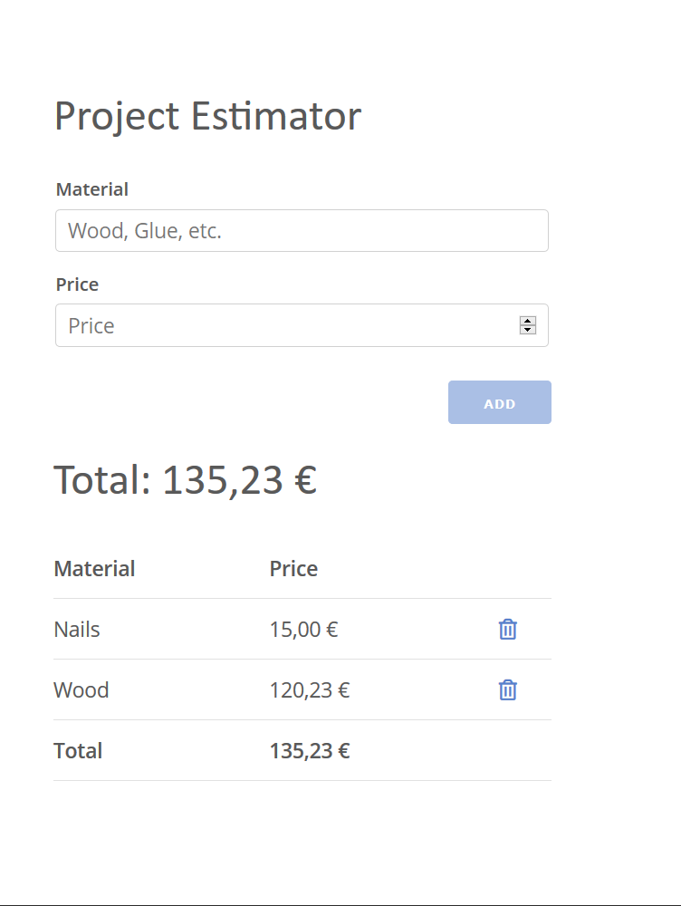

# Svelte Project Estimator

Calculates the total of project materials. Follow the amazing [Tutorial](https://youtu.be/ujbE0mzX-CU) by Noah.  
⚡[DEMO](https://michaelbrunn3r.github.io/tut-svelte-project-estimator)

